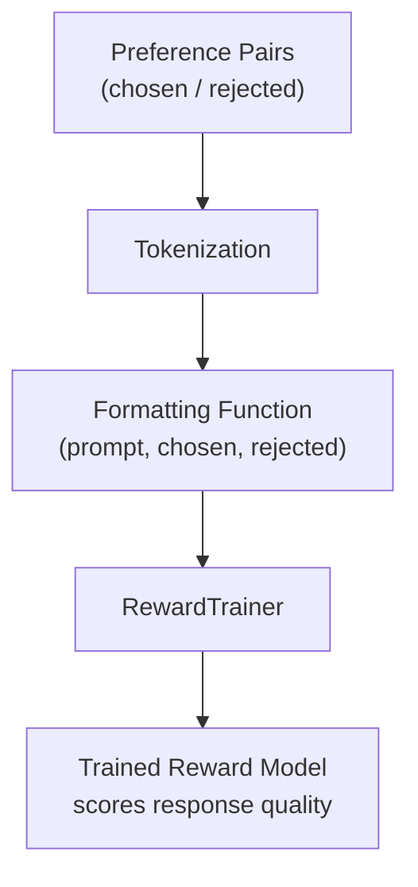
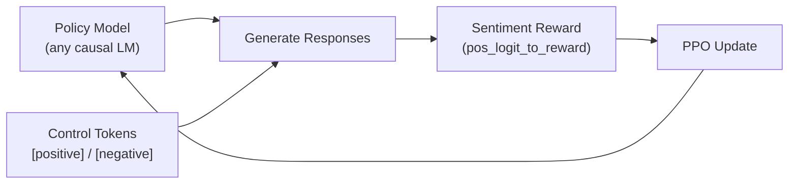

<div align="center">

# RLHF Training for Custom Dataset — Any Model

**Train a reward model and run PPO-based RLHF on your own preference dataset — works with any causal LM from the Hugging Face Hub.**

A single, step-by-step Jupyter notebook that walks through the full RLHF pipeline: preference dataset preparation, reward model training with TRL, PPO optimization with a sentiment reward, and inference. Built to run on CPU (no GPU required).

[](https://python.org)
[](https://pytorch.org)
[](https://huggingface.co/docs/transformers)
[](https://huggingface.co/docs/trl)
[](LICENSE)

</div>

---

## Overview

RLHF (Reinforcement Learning from Human Feedback) aligns language models with human preferences. This notebook implements the complete RLHF stack on **open preference data** and shows how to swap in **any model** from the Hugging Face Hub — no GPU required.

| What | Why |
|------|-----|
| **Reward modeling** | Train a model that scores how good a response is, using human preference pairs |
| **PPO fine-tuning** | Optimize the policy model against the reward signal with control-token rewards |
| **Model-agnostic** | Load any causal LM (`bigcode/tiny_starcoder_py` used by default — tiny and CPU-friendly) |
| **CPU-first** | Runs end-to-end on a laptop (`no_cuda=True`, small batches) |
| **Deployable output** | Save, push to the Hub, and run inference with a scoring function or text-generation pipeline |

---

## Pipeline Steps

| Step | What Happens |
|------|--------------|
| **1. Setup** | Install `transformers` + `trl`, import libraries |
| **2. Dataset** | Load preference pairs (`chosen` / `rejected` responses) from Hugging Face |
| **3. Tokenization** | Tokenize prompts and responses; add a `[PAD]` token |
| **4. Formatting** | Map raw data into the reward-model format (`prompt`, `chosen`, `rejected`) |
| **5. Reward Training** | Train a reward model with TRL `RewardTrainer` |
| **6. Save / Push** | Save the model locally and push it to your HF Hub account |
| **7. Scoring** | Score any prompt + response pair with `get_score()` |
| **8. PPO RLHF** | Fine-tune the policy with PPO using a sentiment-based reward and `[positive]` / `[negative]` control tokens |
| **9. Generation** | Run text generation with the trained model via a `pipeline` |

---

## Datasets

| Dataset | Role |
|---------|------|
| [CarperAI/openai_summarize_tldr](https://huggingface.co/datasets/CarperAI/openai_summarize_tldr) | Source of prompts for reward training |
| [CarperAI/openai_summarize_comparisons](https://huggingface.co/datasets/CarperAI/openai_summarize_comparisons) | Human preference comparisons (`chosen` vs `rejected`) |

Both are open, public benchmark datasets — the notebook shows how to format them into the TRL reward-model format so you can swap in **your own dataset** with the same structure.

---

## How It Works

### Reward Model Training (TRL `RewardTrainer`)



### RLHF with PPO



---

## Quick Start

### Prerequisites

- Python 3.8+
- pip
- Jupyter (or Google Colab)

### Installation

```bash
git clone https://github.com/MaddipatlaChetan24/rlhf-custom-dataset-training.git
cd rlhf-custom-dataset-training

pip install transformers trl
```

> The notebook also needs `datasets`, `pandas`, `pyarrow`, and `torch` — install them if they are missing in your environment.

### Run the Notebook

```bash
jupyter notebook RLHF_Training_for_CustomDataset_for_AnyModel.ipynb
```

Run the cells in order. The notebook was designed on Google Colab but runs on any CPU-only environment.

---

## Configuration

Change these at the top of the notebook to use **any model or dataset**:

```python
Model_name = "bigcode/tiny_starcoder_py"          # any causal LM on the Hub
Data_path = "test.parquet"                        # your preference data

training_args = TrainingArguments(
    output_dir="tinystarcoder-rlhf-model",
    num_train_epochs=1,
    learning_rate=1e-5,
    per_device_train_batch_size=2,
    per_device_eval_batch_size=1,
    eval_steps=500,
    save_steps=500,
    no_cuda=True                                   # CPU-friendly
)
```

---

## Usage

### Score a Response with the Reward Model

```python
def get_score(model, tokenizer, prompt, response):
    # runs the reward model, returns the score for the response
    ...

loss1 = get_score(model, tokenizer, prompt, example_prefered_response)
```

### Push the Model to Hugging Face

```python
from huggingface_hub import login
login()                        # paste your token — saved outside the notebook

trainer.push_to_hub("RLHF model of StarCoder")
trainer.save_model("tinystarcoder-rlhf-model")
```

### Generate Text with the Trained Model

```python
from transformers import pipeline, set_seed
set_seed(42)

pipe = pipeline("text-generation",
                model="tinystarcoder-rlhf-model",
                tokenizer="tinystarcoder-rlhf-model",
                max_length=30,
                num_return_sequences=5)
```

### PPO Reward Signal

```python
ctrl_str = ["[negative]", "[positive]"]
def pos_logit_to_reward(logit, task):
    # maps the positive/negative logits to a scalar reward
    ...
```

---

## Notebook Cell Map

| Cells | Section |
|-------|---------|
| 0 – 2 | Setup: installs, imports, dataset download |
| 4 – 12 | Load model, tokenize, format preference dataset |
| 13 – 18 | Reward model training, evaluation, save / push |
| 21 – 27 | Reward scoring with `get_score` |
| 28 – 45 | PPO RLHF loop, control tokens, generation kwargs |
| 46 | Text-generation demo with the trained model |

---

## Reproducibility

- **Seeded generation**: `set_seed(42)` for deterministic sampling
- **Fixed training args**: epochs, learning rate, batch sizes pinned in the notebook
- **Standard benchmark data**: public, versioned datasets from Hugging Face
- **CPU-friendly defaults**: works without a GPU; tweak batch sizes if memory is tight

---

## Tech Stack

| Layer | Technology |
|-------|-----------|
| **Language** | Python 3.8+ |
| **RLHF library** | TRL (RewardTrainer, PPO) |
| **Transformers** | HuggingFace Transformers |
| **Models** | `bigcode/tiny_starcoder_py` (swap any causal LM) |
| **Data** | HuggingFace Datasets, Pandas, PyArrow |
| **Environment** | Jupyter / Google Colab |

---

## Concepts Covered

- **RLHF**: reward modeling, policy optimization, human preferences
- **PPO**: proximal policy optimization with control-token rewards
- **Preference learning**: `chosen` vs `rejected` response pairs
- **Transferability**: fine-tuning any causal LM with the same pipeline
- **MLOps**: model saving, Hub push, inference pipelines, seeded reproducibility

---

## References

- [TRL — Transformer Reinforcement Learning](https://huggingface.co/docs/trl)
- [RewardTrainer documentation](https://huggingface.co/docs/trl/reward_trainer)
- [CarperAI/openai_summarize_comparisons](https://huggingface.co/datasets/CarperAI/openai_summarize_comparisons) — preference dataset
- [CarperAI/openai_summarize_tldr](https://huggingface.co/datasets/CarperAI/openai_summarize_tldr) — prompt dataset
- [bigcode/tiny_starcoder_py](https://huggingface.co/bigcode/tiny_starcoder_py) — default base model
- [HuggingFace Transformers](https://huggingface.co/docs/transformers)

---

## License

This project is licensed under the MIT License. See the [LICENSE](LICENSE) file for details.

Copyright (c) 2026 Maddipatla Chetan

<div align="center">
<sub>Built with Python, PyTorch, HuggingFace Transformers, and TRL.</sub>
</div>
